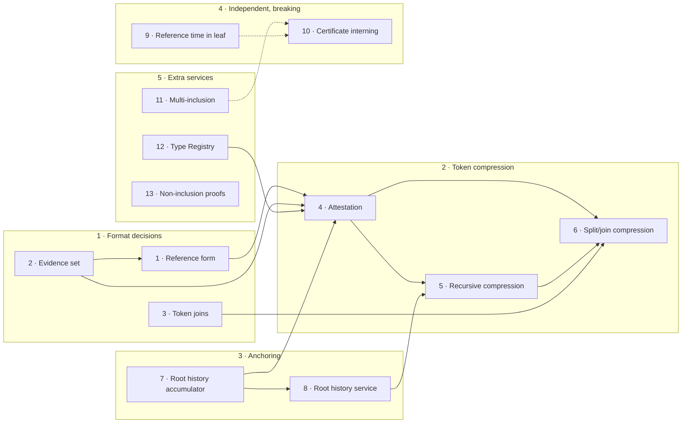

# Change Proposals

Token format and other changes related to efficient token compression.

Risto / 13 August 2026

---

## What we are optimizing

| Resource | Unit | Now, per token with *n* txs |
|---|---|---|
| **Verification complexity** | BFT quorum signature verifications | *n × q* ECDSA verifications |
| **Token size** | bytes | *n ×* (seal + certificate + SMT path) |
| **Provenance overhead** | bytes | all source tokens nested |

where *q* -- quorum size (~number of BFT Core validators), *n* -- transition count, *d* -- number of distinct certification rounds, *k* -- split/join arity, and *D* -- provenance depth.

---

A signature verification costs two to three orders of magnitude more than a hash computation, in a zkVM and real CPU. Not PQ secure, not forward secure.

**Goal.** Verification cost constant in the length of a token's history, in the depth of the provenance the proof expands, and in the number of folds it has undergone. A fold verifies the previous proof in-circuit and emits a single proof, so the relying party sees one proof and one seal however many folds preceded it.

Mint authorizations stay transparent and is always done by the verifier.

Compression is not mandatory background job.

---

## Dependency order

---

## Summary

| # | Change | Primary win | Breaking | Depends on |
|---|---|---|---|---|
| 1 | Mint reason in reference form | **unblocks compression**; removes *D*-compounding | yes, non-migratable | 2 |
| 2 | External evidence set | replaceable, deduplicated provenance | yes, API + token | — |
| 3 | Joins of fungible tokens | functional: value consolidation | no | 2 |
| 4 | The attestation | verification independent of *n* and *D* | yes, token format | 1, 2, 7, 12 |

---

| # | Change | Primary win | Breaking | Depends on |
|---|---|---|---|---|
| 5 | Recursive compression (proof folding) | folds compose at constant cost | no | 4; 8 optional |
| 6 | Compression across split and join | provenance collapses to issuance events | no | 3, 4, 5 || 7 | Root history accumulator | *d* quorum checks → 1, across shards and epochs | yes, consensus level | needs 8 to pay off |
| 7 | Root history accumulator | *d* quorum checks → 1, across shards and epochs | yes, consensus level | needs 8 to pay off |
| 8 | Root history proof distribution service | no reliance on past-epoch validator sets | no | 7 |

---

| # | Change | Primary win | Breaking | Depends on |
|---|---|---|---|---|
| 9 | Reference time in the leaf value | functional: `tlock` / `htlc` become secure; BFT-enforced | yes, leaf value | — |
| 10 | Seal / certificate interning | wire ~4×, computation *n* → *d* | yes, token format | 11, to be practical |
| 11 | Multi-inclusion proof service | wire *O(k·log(L/k))* not *O(k·log L)* | no | — |
| 12 | Token Type Registry | portable verification policy | no | — |
| 13 | Non-inclusion proofs | authenticated negative statements | no | — |

---

# Breaking token format changes

---

## 1. Mint reason in reference form

**Summary.** `SplitMintJustification` (tag 39044) changes from `[token, [proofs…]]` (full source token embedded) to `[ver, source_token_id, [proofs…]]`.

**Why.** Reason bytes are embedded in `MintTransaction.justification`, hashed to `txhash`, which is certified value of genesis leaf. Applies to every input. An *attestation* works by replacing a source token with a compressed proof about it; but any substitution changes `txhash` and invalidates the genesis certification of all *k* outputs.

**Also why.** Allows deduplication.

**Alternatives.** Introduce a second reference-form tag alongside 39044, so that both can be used either forever or for some period

**Scope.** Tag 39044 encoding format, the split verifier in all SDKs.

---

## 2. External evidence set

**Summary.** A container related to the token: a flat, canonical map from token identifier to either a complete token ending in the consuming burn, or an attestation plus that burn. Resolved transitively. Not explicitly signed.

**Why.** Reference form (#1) names sources; these have to be resolved and stored somewhere.

**Wins.** Evidence becomes *replaceable*: a recipient who receives a token without usable evidence obtains it from anyone holding the ancestor data — the previous holder, the issuer, an archival service — instead of being permanently unable to verify. *deduplicated*: an ancestor reachable by several paths through the provenance graph appears once and is verified once.

---

**Alternatives.** Carry the evidence inside the token as a trailing table. Simpler logistics, less flexible.

**Scope.** New top-level type; `Token::verify` gains an evidence parameter. Breaking API change, token addition.

**Implementation.** Canonical CBOR map with strictly increasing keys. Duplicate keys are dropped, a missing named entry fails token validation, entries with no reason format names are ignored.

---

## 3. Joins of fungible tokens

**Summary.** Define and implement the merge reason format: *k* sources burned, one token minted whose per-asset amounts sum to the inputs.

**Why.** Complementary to the Split. Stop value fragmentation in wallets. Token compression makes it make sense. Not breaking, but must be defined before changes below.

**Alternatives.** Burn *k* and mint one under a trusted issuer signature, which reintroduces a trusted party for an operation that should be trustless. Or transfer *k* tokens instead of one merged and consolidate them at ui level.

**Scope.** New CBOR tag and verifier, mirroring the split path: manifest, conservation arithmetic. Additive, non-breaking.

**Implementation.** `[ver, ⟨id₁…id_k⟩]`, with the burns resolved from the evidence set (#2). Conservation is summation over the sources' asset collections. Prerequisite for #6.

---

# Token compression capability

---

## 4. The attestation

**Summary.** A constant-size object representing a token's history and provenance. Connected to the rest via public inputs: identifier, type, the state reached, the owner predicate, the proof, the anchor seal (optimally only one), and the bare mint transactions of every genesis the prover did not verify in-circuit (keep issuance transparent)

**Why.** It replaces an arbitrarily long history and an arbitrarily deep provenance with one unicity proof and one signature verification.

**Wins.** For the relying party, verification becomes optimally one zk proof, one unicity seal, and one *mint authorization* check per input genesis, verifying mint authorization only (no certificate and no historical trust base). Independent of history length, expanded provenance depth and folding count.

---

**Alternatives.** Skip zero-knowledge entirely and rely on #10 and #11: takes *n* seals down to *d*, which is a large win, but leaves *O(n)* SMT paths and *O(n)* bytes. Or have a trusted attestor sign the summary.

**Scope.** New CBOR type: as an evidence entry stored as the first item in token tx history. `Token` gains an attestation slot, and the `[transaction, inclusionProof]` pairing must support a non-certified mint with no proof when an attestation already anchors the genesis. Breaking.

**Implementation notes.** The opaque-genesis commitment is a sorted, deduplicated set of genesis transaction hashes. The verifier verifies mint txs in clear - this justifies #12 below.

---

## 5. Recursive compression (proof folding)

**Summary.** An attestation may verify previous attestation in-circuit - this extends compressed history.

**Why.** Compression can be run any time, and across the joins. *Proving* cost per fold is one recursive verification plus one re-anchoring, independent of the sub-proof's transfer count, provenance depth, or anchor age. *Verification* cost does not grow with folds.

**Anchoring.** A sub-proof's public inputs must be validated to match the rest of the token and genesis and unicity cert. Possibilities: 1) prefix consistency against the current accumulator (hashing only, needs #8 (calendar database)), or 2) in-circuit verification of the sub-anchor's unicity seal (one quorum verification per epoch, needs the unicity trust base record for that epoch).

---

Prefix consistency ties the sub-anchor to the latest, single unicity proof verified outside the circuit. Both methods can be supported in parallel, seal verification if calendar db is not available / implemented.

**Alternatives.** Brute force: cost grows with total provenance and tx history. Or one anchor per fold in clear, verified by the verifier, so the attestation grows with merge history.

**Scope.** Relation definition and verification-key pinning, plus a trust base commitment in the public input. Additive on top of #4.

**Relation count.** One relation and one `vk_tok` for every token type. (ie, NFT-s just skip value conservation). Do not support per-transfer type rules. (bridging uses another format which also verifies bridge-specific genesis in-circuit)

**Proof format.** Inside Unicity: SP1 compressed STARK, poseidon2 in proof,verifiable recursively. Groth16 SNARK wrapping only when bridging out.

---

## 6. Compression across split and join

**Summary.** Provenance graph collapses to the set of source issuance events behind the token.

**Why.** Makes the compression really useful.

**Wins.** At split time no proving occurs: the splitter hands each of the *k* outputs the *same* attestation (with transparent burn). Shared proving for all *k* recipients. At merge, each of the *k* sources contributes one attestation and the merged token's own attestation folds them again to constant size.

**Alternative.** Each value-conserving genesis (of split/join) is either verified in-circuit (opaque) or transparent.

**Scope.** Depends on #1, #2, #3, #4 and #5.

---

# Anchoring infrastructure

---

## 7. Root history accumulator

**Summary.** Add `a_r` to the Unicity Seal: a Merkle mountain range over every Unicity Tree root the network has certified. The BFT Core retains only the frontier, one hash per set bit of the round count, at *O(1)* amortized cost per round.

**Why.** One recently verified seal then authenticates efficiently any earlier round root. Across shards and epochs.

**Wins.** Computation: *d* quorum verifications become one, plus *O(d·log N)* hash compressions. The relying party also does not need the trust base of an earlier epoch to validate earlier proofs, and a seal from an abandoned branch cannot be substituted because its root is not in the accumulator of the chain the verifier is on.

---

**Alternatives.** A linear linking hash chain using the currently unused `previous_hash` ($r_-$): *O(1)* state, but linear proof length. Or as it is now: brute force verifying all seals: lots of expensive signature verifications.

**Why MMR.** Proofs for recent rounds need only the frontier plus a short tail of roots, easy to prune.

**Scope.** New field in `UnicitySeal`, BFT Core round state amended. Breaking change (at the consensus level). Also needs #8 to be complete.

**Implementation notes.** Deterministic computation, no new consensus level rules.

---

## 8. Root history proof distribution service

**Summary.** Membership, batched membership, and prefix-consistency queries over the accumulator, served by aggregators and/or archive nodes as an optional service.

**Why.** 1) Reconciling certificates collected from several shards (spans at most `t2` of rounds), 2) Reconciling an older attestation's anchor when folding.

**Wins.** No dependency on old PKI signatures; no in-circuit quorum verification to authenticate epoch changes and seals on top of folded-in attestations.

---

**Alternatives.** Run no service and rely on in-circuit seal verification for every fold. Trusts the validator set of a past epoch.

Reconcile certs on top of clear transactions, using batch inclusion cert queries (asynchrony is not an issue, BFT Core certifies entire IR every round anyways, entire IR must be returned though to Aggregators). No need for #7.

**Scope.** Aggregator (or archive node) query surface; no BFT Core involvement (depends on #7). Additive, non-breaking. Recovery service to obtain long history / fill in blanks.

**Implementation notes.** Prunable history, service is not trusted.

---

# Independent breaking changes

---

## 9. Commit reference time in the SMT leaf value

**Summary.** The leaf value becomes `H(txhash, τ)` instead of `txhash` alone, where τ is the round's `IR.t`. Certified transactions carry τ. **Specified; landed on `main`.**

**Why.** Predicate evaluation already takes τ as an argument, but τ was recoverable only from the inclusion proof, as `UC.IR.t`. The SMT is append-only, so a leaf can be certified afresh against any later root, and a later proof carries a later round's `IR.t`. Reference time was a property of the *proof*, not of the leaf, so re-presenting a leaf changed the predicate evaluation outcome. `tlock` and `htlc` are specified but not safely usable as-is.

**Alternatives.** 1) No time-dependent predicates. 2) Sandwich: non-inclusion proof at `h'` plus inclusion proof at `h` of the same IR.

---

**Scope.** Leaf value, so `sid`, `D`, `txhash` and the certification request are all unchanged and the transaction format does not move. Split and merge output commitments are unaffected. Breaking for the aggregator, the inclusion-proof consumers in all SDKs, and the BFT Core's consistency check.

**BFT Core enforces it.** The Core already receives the batch `B` of `(sid, txhash)` pairs with the opcode stream, and already checks `CR.IR.t` against the previous seal. It now derives `B* = ⟨(sid, H(txhash, τ))⟩` and verifies the consistency proof against `B*`.

**ZK instantiation.** The ZK-compressed consistency proof exposes no batch, so τ becomes a third public input.

---

## 10. Unicity seal and certificate interning

**Summary.** Factor the seal out of each `InclusionProof` into a table carried once per token, with the certificate's seal field becoming either an inline seal or an index. Optionally allow proofs to be omitted entirely, leaving the verifier to fetch them.

**Why.** Each transition currently carries a complete quorum signature set. Re-presenting all leaves against current roots removes redundancy.

---

**Example.** *n* = 100 transitions over 40 shards, *q* = 67, *d* = 2 distinct rounds after re-presentation:

| | baseline | re-presented + interned |
|---|---|---|
| seals | 100 × ~5 KB | 2 × ~5 KB |
| certificate bodies | 100 × ~0.5 KB | 100 × ~0.5 KB |
| SMT paths | 100 × ~1 KB | 100 × ~1 KB |
| **total** | **~650 KB** | **~160 KB** |
| **quorum verifications** | **100** | **2** |

**Alternatives.** A generic content-addressed object table. Or omit proofs entirely and have the verifier fetch them, which minimizes the token size but makes verification online.

**Scope.** `Token` CBOR version bump; index resolution happens at decode so no verification code changes. All SDKs. Breaking token format change.

**Implementation notes.** Intern by seal hash. Interning whole certificates probably does not make sense.

---

# Extra services

---

## 11. Multi-inclusion proof service

**Summary.** `GetInclusionMulti(⟨sid₁…sid_k⟩)`, returning one inclusion certificate covering all *k* keys of one shard against that shard's last certified SMT root, with the certificate that certified it.

**Why.** *k* paths in one RSMT share their upper internal nodes. A shared certificate is *O(k·log(L/k) + log L)* instead of *O(k·log L)*, and one round trip per shard instead of *k*. This is what makes wholesale re-presentation of a long history practical, so it is the enabler for #10.

---

**Alternatives.** Issue *k* separate calls: more network connection overhead, harder de-duplication

**Scope.** Aggregator API addition plus an SDK client method. Additive, non-breaking.

**Implementation notes.** Answer against `SI[β,σ].UC₋`, the tree version already retained to serve ordinary inclusion proofs. The response is per-shard; a client whose keys span several shards issues one call per shard and reconciles the results.

---

## 12. Token Type Registry

**Summary.** Make the verifier registry Γ = (reason verifiers, type definitions, resource budget) a real artifact: (type identifier, definition manifest) pairs carrying admissible reason formats, payload rules and issuance policy parameters, with content-addressed type identifiers.

**Why.** Verification today fails closed on any justification tag the local registry does not know. That is the correct default, but it means every verifier hand-configures its own trust, and no capped-supply or issuance policy is checkable by a party who was not told about it out of band. Compression makes this acute: attestation verification runs mint authorization for *every* genesis the proof left in the clear, under the verifier's own Γ, in ordinary auditable code.

---

**Alternatives.** Keep per-application registries — the status quo, which works and does not scale socially. Or put the registry on-chain, which needs consensus machinery for coordination data that is not a trust root.

**Scope.** New off-chain artifact plus schema. The SDK's `MintJustificationRegistry` and `TokenDataVerifier` become the local view of it. Additive, non-breaking.

**Implementation notes.** The consensus-relevant binding comes from the frozen definition itself, self-authenticating because the identifier is content-addressed from the canonical CBOR manifest. The registry supplies discovery and naming only. Consensus-relevant fields must be append-only: an entry published as active is never modified or reassigned, only deprecated.

---

## 13 · Non-inclusion proofs

**Summary.** Authenticated negative statement: *this state identifier was absent from the certified tree at round n*.

**Why.** The Unicity Service's guarantee is that at most one transaction is ever certified per state identifier. Inclusion proofs make the *positive* half of that guarantee verifiable. Negative proof is complementary, allowing to prove that an asset was not spent yet at a certain point. Also, options expire, escrows time out, deadlines lapse, rights go unexercised. With non-inclusion, "the deadline passed unexercised" becomes a fact anyone can prove to anyone, including to systems outside Unicity, without depending on a counterparty's cooperation.

**Note.** An unspent state may be spent at any moment, so a non-inclusion proof is a snapshot. It becomes *permanent* only when the state can no longer change, which can be guaranteed by e.g. `htlc` kind of predicate. Or knowing that no-one (else) can make the tx.

---

**Usage.** A non-inclusion proof cannot itself be re-presented. For deterministic outcome, the actual response with the original seal must be committed to whatever user data artifact.

*Accountability*: a client can demand an authenticated "not recorded" as part of tx receipt.
*Time sandwiching*: non-inclusion for `sid` at round *m* plus inclusion at round *N* bounds certification to *(m, N]*, supplying the lower bound a `tlock` needs without the original certificate. Poor substitute for #9.

**Alternatives.** Query the aggregator and trust the answer.

**Scope.** Already specified and implemented in `rugregator` as `get_non_inclusion_proof.v1` and the Rust SDK. Additive, non-breaking.

